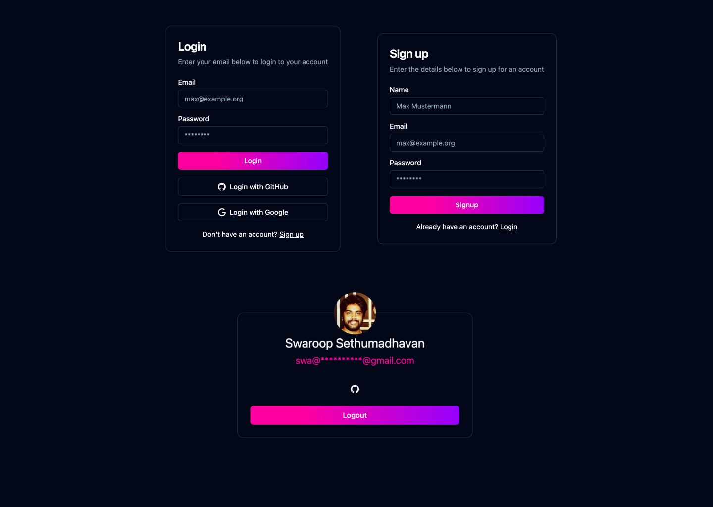

# surrealdb-auth-example

An example app demonstrating authentication using surrealdb.



##### Tech stack:

- [SurrealDB](https://surrealdb.com/)
- [Go](https://golang.org/) with [Gin](https://gin-gonic.com/) HTTP framework
- [Remix](https://remix.run/)

## Getting started

### Backend

- Make sure you have `docker` installed
- Rename `surrealdb/config.sample.surql` to `surrealdb/config.surql` and adjust the values appropriately
- Run `docker compose up --build -d`
- Run `make import` to import the surrealdb schema and functions

### Frontend

- `cd frontend`
- `npm i`
- `npm run dev`
- Visit: `http://localhost:5173`

## Development

### Running the Go backend locally

```bash
# Build the Go application
go build .

# Set environment variables
export SURREALDB_ENDPOINT=http://localhost:8000
export SURREALDB_NS=surrealdb_auth_example
export SURREALDB_DB=default
export FRONTEND_URL=http://localhost:5173

# Run the application
./surrealdb-auth-example
```

## SurrealDB Functions:

| Name                         |                                      Description                                       |
| ---------------------------- | :------------------------------------------------------------------------------------: |
| `fn::github__oauthUrl`       |   Get oauth url for github that can be used to redirect the user the consent screen    |
| `fn::github__oauthAuthorize` | Exchange the auth code for an access token and return the user info of the Github user |
| `fn::google__oauthUrl`       |   Get oauth url for github that can be used to redirect the user the consent screen    |
| `fn::google__oauthAuthorize` | Exchange the auth code for an access token and return the user info of the Github user |
| `fn::whoami`                 |                      Returns basic info of the authenticated user                      |
